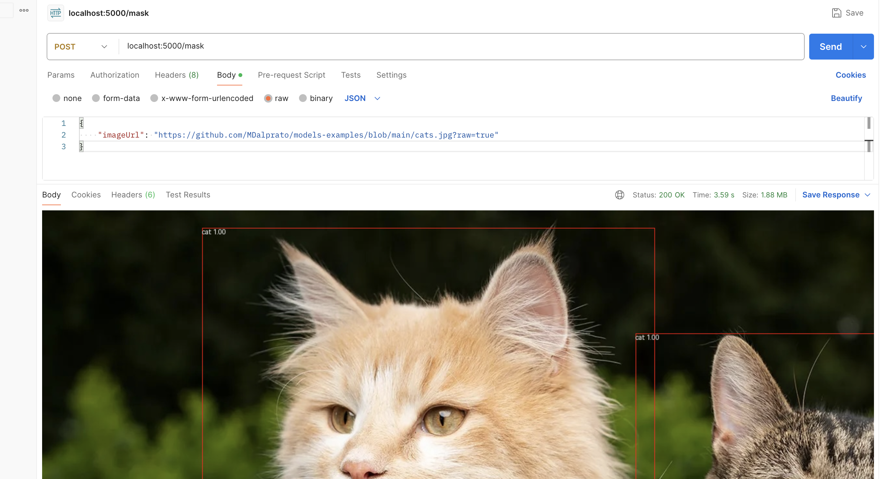

# AI models

This repo is a collection of various ai models that can be used to understand an learn a bit more about AI


<h2 style="color: red;">How to use them</h2>

Every python file uses flask in order to create simple HTTP server, so if you wan to try it you need to run one of the files you just need to send a JSON object like the once in the examples to the 'localhost:5000/senntiment' route. As you can see in the code it's a POST request. 
I personaly suggest to use POSTMAN for this.

<h2 style="color: red;">sentiment-analysis.py</h2>

This is a simple example of how to use "sentiment-analysis" template. This template provide a JSON output based on the input text.
The output will be an array of JSON object following the current schema:

```json
[
    {
        "label": "POSITIVE",
        "score": 0.9974023699760437
    }
]
```

The "label" key will be "POSITIVE" is the incoming sentence has a positive sentiment insthead will be "NEGATIVE" is the feeling is negative (sad, bad ecc..)
The "score" key is be a number between 0 an 1. Zero means that the prediction is not realibale, 1 measn that the prediction is absolutely correct.
Input text will, of course, change the output data.
For example:

```json
{
    "text": "Today is a rainy day"
}
```
will provide something like this:

```json

[
    {
        "label": "NEGATIVE",
        "score": 0.9540587067604065
    }
]
```

but this input:

```json
{
    "text": "Today is a rainy day but I'll get my salary"
}
```
will redue the "score" value so something less certain

```json

[
    {
        "label": "NEGATIVE",
        "score": 0.8500044345855713
    }
]

```

If we add **I will meet my girlfriend**

```json

{
    "text": "Today is a rainy day but I'll get my salary and I will meet my girlfriend"
}

```

se sentiment will be a 0.99 POSTIVE one

```json

[
    {
        "label": "POSITIVE",
        "score": 0.9974023699760437
    }
]
```

Did I trigger your attention ?

<h2 style="color: red;">fill-mask.py</h2>

Fill mask is used to 'fill' text in a provided input guessing which one will be the best one.
Sames as before, just send a JSON payload as follow:

```json
{
    "text": "Today I'm feeling <mask>"
}
````
and you'll get an array of possibile Object as respose
```json
[
    {
        "score": 0.03881606459617615,
        "sequence": "Today I'm feeling better",
        "token": 357,
        "token_str": " better"
    },
    {
        "score": 0.03545308858156204,
        "sequence": "Today I'm feeling fine",
        "token": 2051,
        "token_str": " fine"
    },
    {
        "score": 0.033157315105199814,
        "sequence": "Today I'm feeling good",
        "token": 205,
        "token_str": " good"
    },
    {
        "score": 0.03189675137400627,
        "sequence": "Today I'm feeling optimistic",
        "token": 7168,
        "token_str": " optimistic"
    },
    {
        "score": 0.031621918082237244,
        "sequence": "Today I'm feeling okay",
        "token": 8578,
        "token_str": " okay"
    }
]
```
This transformation pipeline is not the most realibale but for some basic guessing such as autocompliting textbox or similar function could be useful.

<h2 style="color: red;">object-detection.py</h2>

Object detection is a complitely different task that require GPU and a little more effort. If you, like me, are using a mac you need to install 'timm' in order to use CPU insthead of GPU for image manipulation.

So, please install:

- pip3 install torch torchvision torchaudio
- pip3 install timm

Now you can send a JSON object with

```json
{
    "imageUrl": "https://github.com/MDalprato/models-examples/blob/main/assets/cats.jpg?raw=true"
}
````
and you'll get a beautiful image with some red boxes around the object that the pipeline was able to detect.
As you can see below I've used the 'cats.jpg' image that you can find in the assets folder ... but you can try with all types of images that you need.



